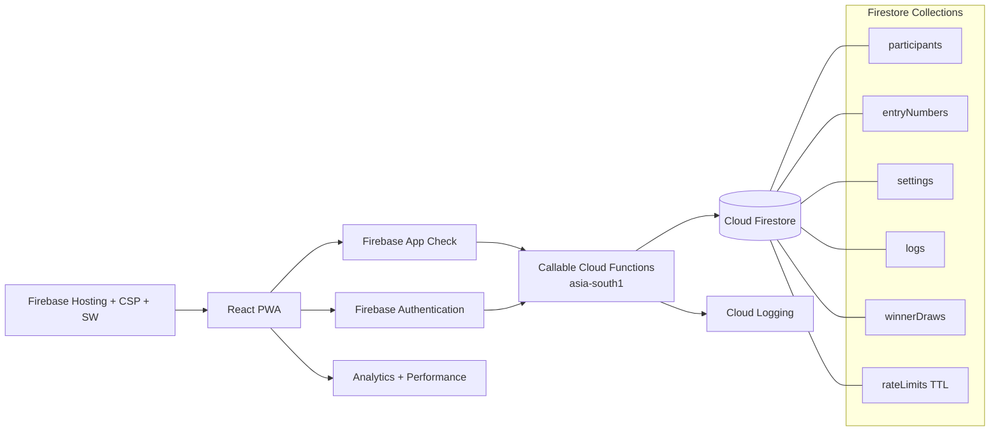

# Architecture

## System diagram



## Frontend boundaries

```text
src/
├── animations/       Motion presets, reveal and page transitions
├── assets/           Brand-owned source assets
├── components/
│   ├── admin/        Admin shell, metrics, drawers and empty states
│   ├── brand/        Brand lockup
│   ├── content/      Legal/content patterns
│   ├── errors/       500, network and connection handling
│   ├── interactions/ Pointer tilt
│   ├── layout/       Public and portal shells
│   ├── providers/    Provider composition
│   ├── pwa/          Service-worker update UX
│   ├── seo/          Helmet metadata and JSON-LD
│   ├── ui/           Shared accessible design system
│   └── visuals/      Hero media placeholder
├── constants/        Campaign, navigation and brand constants
├── context/          UI, participant and admin auth state
├── firebase/         Firebase Web SDK initialization
├── hooks/            Countdown, motion, auth and UI hooks
├── pages/            Lazy route modules
├── routes/           Canonical paths and route guards
├── sections/         Public page sections
├── services/         Typed remote, export, monitoring and analytics adapters
├── styles/           Design tokens and global utilities
└── utils/            Pure helpers
```

UI components never import Firestore. Typed services invoke Callable Functions. Context providers orchestrate state without embedding vendor behavior into presentational components.

## Backend boundaries

```text
functions/src/
├── admin/             Admin auth, overview, participants, analytics, settings, logs, winners
├── security/          Rate limits, client error reporting, security logging
├── services/          Participant verification, registration, locations, settings
├── utils/             Validation, hashing, payload checks, entry numbers
├── config.ts          Region, App Check and campaign defaults
├── firebase.ts        Admin SDK initialization
└── index.ts           Callable exports
```

## Trust model

- Browser state is untrusted.
- Anonymous Auth identifies a participant session but is not identity proof.
- App Check establishes application authenticity and bot friction.
- Cloud Functions validate payloads and own every sensitive write.
- Firestore Rules deny browser access to sensitive collections.
- Admin custom claims are checked on every admin callable.
- Transaction boundaries enforce duplicate mobile and entry-number uniqueness.
